# Taskman

Since my last couple of programs, im trying to focus one alinging my programs more with the UNIX philosophy - doing one thing and doing it well!

Taskman is a simple task manager that allows you to add, remove, and view tasks and appointments from the command line. 
It stores the data in a simple SQlight database, making it easy to manage and query your tasks.

## Features
- Add general tasks with a description
- Dated task for specific days
- Appointments with a description, date and time
- Add reccurring tasks (daily, weekly, monthly) with simple syntax
- View and outlook tasks andWith the command '-n "task | date"' you can add a task with a description and a date.
- Postpone tasks and appointments
- Marked tasks and appointments as completed
- Command to allow a check of appiontments comming up in the next 15mins -> perfect for a Crontab job (-check)

### Task Input
Taskman -h or --help will show you the help menu with all commands and options. Here is a quick overview of the basic commands:

task -> "task/appointment | *date | *time"

recuring tasks -> "task/appointment | frequency | start_date | *end_date | *time"
 * [*] denotes optional fields and will alter the task type accordingly

### Bash Example Session

A few input examples:
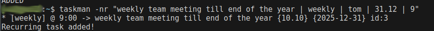
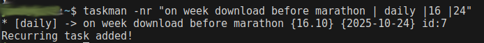
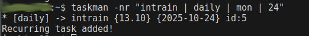
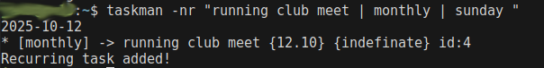
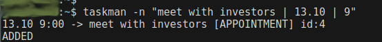
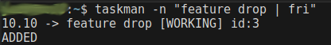
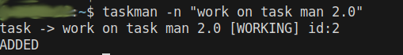
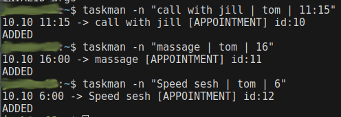

then looking at todays tasks:

now to complete a task:

and now that task is gone from the list:

some forcase views:
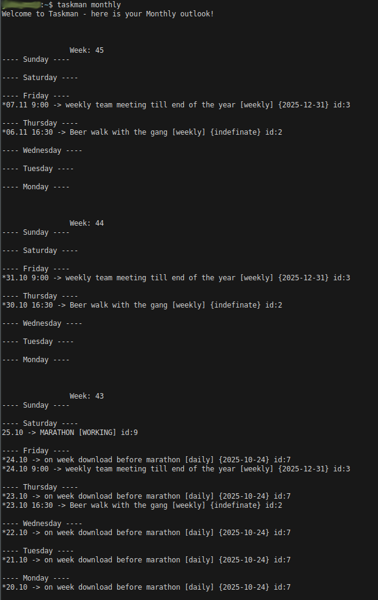
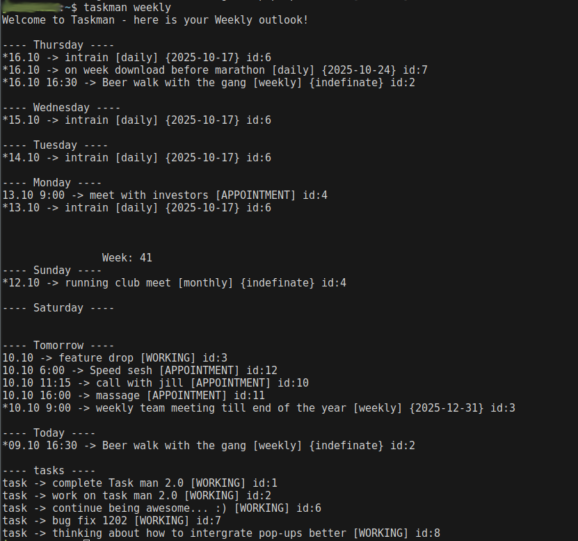
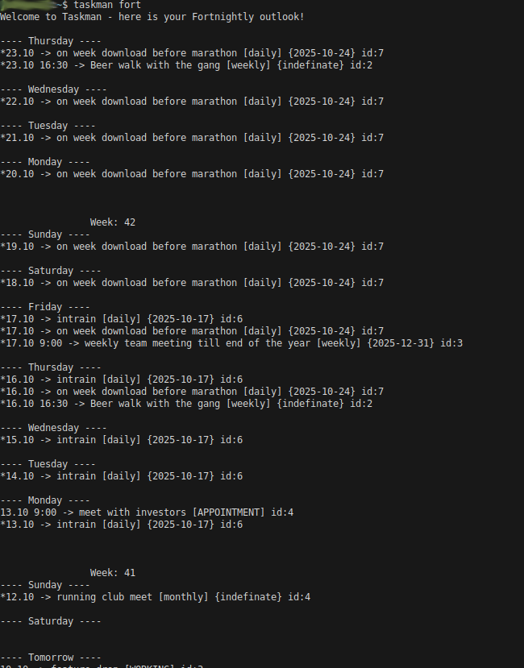
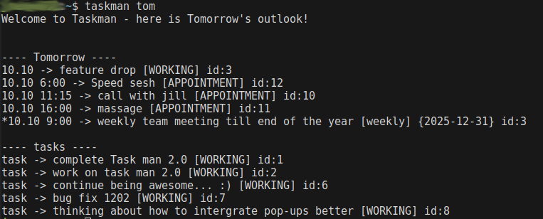

Crontab reminder:
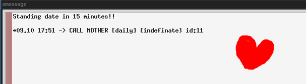
sooo beautiful!

## Installation
To install Taskman, simply clone the repository and compile the code using gcc with the Makefile provided.
Best practise is to change the database path from "tasks.db" in the Markfile with your desired database file path. 
Make a Crontab job with the -check command to get notified of upcoming appointments. Then you're ready to go!
